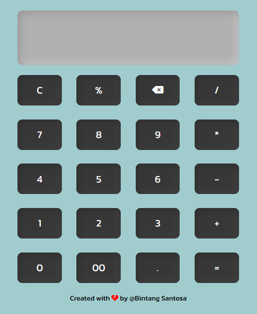

# Simple-Calculator
This is a simple calculator web app built with HTML, CSS, and JavaScript.

Features
Basic arithmetic operations: addition, subtraction, multiplication, and division.
Percentage calculation.
Clear button (C) to reset the input.
Delete button (⌫) to remove the last entered character.
Support for decimal numbers.
Equal button (=) to evaluate the expression and show the result.
How to Use
Clone or download the repository to your local machine.
Open the index.html file in your web browser.
Use the buttons on the calculator interface to perform calculations.
The input area displays the current expression, and clicking "=" will show the result.
Preview

Built With
HTML
CSS
JavaScript
Font Used
Kanit - A font from Google Fonts
License
[Include the appropriate license here, such as MIT or any other license you prefer.]

Acknowledgments
[If you used any external resources or libraries, give credit to their authors and provide links.]

[Add any other relevant sections if necessary.]

Feel free to contribute to this project or use it as a starting point for your own calculator app! If you encounter any issues or have suggestions, please open an issue or pull request. Happy calculating!
